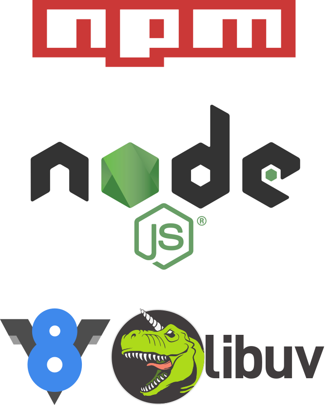

class: center, middle

# Getting to know Node.js
---

# Getting to know me

 Hi, I am josh Hollandsworth

???
 College drop out that spent too much time working on personal projects to go to class, went to work at a telco where i wrote middleware and backend services to integrate
 voip and iptv systems, before leaving for scottrade in 2014, came to asynchrony in July of last year

---
# Intended Audience

???

As we deal with clients whether internal or external its always important to set expectations. I imagine you are coming into this talk to learn something about Node.js, it is reasonable for you to expect that I will present this in a manner that is easy to understand, am informative, and generally not wasting your time. Can we all agree that this are some reasonable expectations? Awesome! now that i you have your expectations of me as the producer, I have some expectations of you as the consumer. So lets get started by going over those.

--

- People who have some exposure to development and have a cursory knowledge of programming in general

???
Now lets be clear this does not mean that i exepct you to be programming geniuses or even a developer as your primary job function. This talk does include code and will be discussing problems in computer science so the ability to follow along with patterns etc is very important.

--

  - ES6 exposure is helpful but not necessary

--

- People who are not Node.js experts


---
# What are we going to cover.

--

- What Node.js is and is not

--

- How Node.js works

--

- The EventEmitter Pattern

--

- Streams

---

# What Node.js is not

--

- A server

--

- The answer to all of your problems

???

Node.js is not an javascript based server, although it does lend itself well to creating servers written in javascript. Therefore like all tools it is not the ultimate answer to all of your problems, but it can be used to create scalable backend services.

---
# What is Node.js

Node.js® is a JavaScript runtime built on Chrome's V8 JavaScript engine. Node.js uses an event-driven, non-blocking I/O model that makes it lightweight and efficient.

 -- Node.js Foundation

???

V8 is a JavaScript implementation written in C++ and created/maintained by Google. Node.js is built upon this engine and adds functionality via libuv to make blocking synchronous libraries asynchronous

---
# What is Node.js - Components



???

This is a simplistic version of the Node.js architecture. However for an initial look into what node is and what it is not, it will suffice. As you can see Node.js is built upon Google's V8 and Libuv as we previously mentioned. At this same layer there are modules to support DNS, Crypto, The event loop. At the next layer is the Node.js api which has a handful of baked in modules upon which your applications will be built. At the top is npm. NPM is not part of the actual runtime stack however has earned its place in the architecture because of the shear number of modules that third party developers have created. Your application can either be built upon the vanilla node.js api, or a combination of it and modules sourced via NPM

---
# Brief History of Node.js

- 2009  Ryan Dahl Creates Node.js
- 2011 NPM is created
	- Microsoft Works with Joyent to bring Node.js to windows
- 2014 Node.js is forked to IO.js
- 2015 Node foundation is created and later IO.js and Node.js merge

---
# Why Node.js

--

- Allows developers to use nothing but JavaScript (Mostly)

--

- Massive package ecosystem

???

JavaScript is lingua franca of the internet and has long been ubiquitous with creating dynamic client side content. Node.js allows developers to use the same languages and tooling that the have become accustomed to for front end development on the back end. However, if you so desire, you can write modules that interface with V8 in C++.

--

- Ease of use

???

Unlike Apache, Node.js does not have a hierarchal configuration or any real configuration outside of what is needed to execute a given node.js script.

--

- Scalability and Speed

???
Node.js scales well in part because it does not spin up threads or fork processes for each request. Therefore node.js has less overhead for each request processing. Additionally since node.js is asynchronous the actual handling of each request can be delegated allowing the primary thread to accept more request rather than completing each one before accepting a new one. Finally, given that a most applications on the internet use JSON for a data transfer node.js has an advantage by being JavaScript and having supported baked in unlike .NET, PHP, or JAVA which rely on marshalling libraries to convert between JSON and the native language.

---

# How it all works - Node.js and I/O

I/O is universally slow, Node.js accepts this and allows you to continue working while the I/O systems do their work.

???

Even though speeds are constantly increasing; consuming I/O sources ranging from network/sockets to file system and event memory access are slow. Node.js accepts this and addresses this problem with its Non-Blocking I/O model which allows applications to keep doing work while waiting for some I/O task to complete.

---
# How it all works - Non-Blocking I/O

A restaurant that can only serve one patron at a time will not stay in business

???

To really understand how Node.js benefits from Non-Blocking I/O lets take a look at a real life example that benefits from both blocking and Non-Blocking interactions. The example I am going to use is that of a restaurant.

A restaurant that can only serve one patron at a time will go out of business. Imagine if your server took your food and drink order, made your drinks and stood by the window waiting for your food to come up. Once that was up they brought it to you. While you ate the server went off to some corner to wait for you to finish, once you finished they would bring your check, you pay and then and only then could the server wait on the next patron...as I think we all could imagine, the yelp reviews for this restaurant would be brutal.

---

# How it all works - Blocking I/O

Every Entrée must be prepared a certain way to be correct.

???

The important part of this statement is the "...to be correct" part. This is because with rare exceptions, there is a certain flow that must be maintained in order to make entries. For example, if you were to order a burger and find that the patty was not cooked, was placed on top of the bun because the bun was not sliced and the lettuce had not been washed. I am going to go out on a limb here and guess that you wouldn't want to eat that sandwich. Furthermore, you would most likely send it back and/or run for your life with serious doubts of what type of operation they were running.

---
# How it all works - Event-Driven

--

- Everything that happens is an event (request received, response sent, error)

???

And like all analogies that are used to explain something the restaurant example works perfectly to explain event driven applications. In a restaurant there are at least three systems in play, the server, the hungry patron, and the kitchen staff. The amount of events that a single system can perform or too numerous to list. But a quick summation could be that the patron is seated, orders food, and eats food. the server takes order, brings the food and refills drinks, mean while the kitchen staff receives orders and cooks food.

--

- Application logic flows based on one of these events

---

# EventEmitter - Overview

--

- The core module backing the majority of Node.js event-driven architecture.

--

- Primary functions of interest are emit() and on()


???
If you are coming from a ruby world, EventEmitter functions a lot like EventMachine. However if you're not familiar with nodes EventEmitter or ruby's event machine, simplistic model you can use to conceptualize what an event emitter is that of the pub/sub pattern. However in Node.js EventEmitter is more than just a module, it is central to everything that node does and is the basis for a decent chuck of node.js core api.

---
# EventEmitter - emit()

Listeners are notified via emit() which emits a named event.

```javascript
  eventEmitter.emit('guestSeated');
```

???

Emitting an event is pretty straight forward, however it is important to know that your listeners will be executed synchronously, and in the order that they were registered. There are ways to get around this which will be discussed in a moment

---
# EventEmitter - on()

Listeners are registered with an on() method that specifies an event name, and the function to be called when the event occurs

```javascript

eventEmitter.on('orderPlaced', (order)=> {
  order.forEach((item)=> { startCooking(item); });
});

```

???

like emitting an event, adding a listener is pretty straight forward. As you can see from the example it is possible to use ES6's fat arrow syntax, however you must pay special attention to this scope, as the fat arrow gets its own this  binding.

Furthermore all of the rules for what makes a fat arrow function valid hold true in as an listener.

---

# EventEmitter - Example

```javascript

const kitchen = new NodeKitchen();

kitchen.on('orderUp', (items) => {
  items.forEach((item)=> {
    console.log(`Finished Cooking ${item}!`);
  })
});

kitchen.emit('orderUp', ['Node Nuggets', 'ES Fish sticks']);

```

--

*Cooking Node Nuggets!*

*Cooking ES Fish Sticks!*

---

# EventEmitter - Creating Your Own

 - Extend from the EventEmitter class (utils.inherits if not using ES6)

 - Not necessary but can be helpful to wrap on() and emit() in functions that provide business logic

---


# Streams - Overview

  - Every Stream is an *EventEmitter*
  - Four Types of streams (Readable, Writable, Duplex, and Transform)

???

---

# Streams - Readable

  An EventEmitter wrapper that reads data from a source

--

Main events
- data: Data is available on the stream
- end: When (and only when) the end of the data is reached

---

# Streams - Readable (Example)

```javascript

let fs = require('fs');

let input = fs.createReadStream('words');
let words ='';
input.on('data', (chunk)=> { words += chunk; });
input.on('end', () => { console.log(words); });

```
???

import the fs module to read/write from file system
create empty string "words"

every time a chunk is read, append it to the words string
when the end of the stream is read, log the contents of words to the console.

---

# Streams - Writable

An EventEmitter that writes data to a destination

???

Unlike a readable stream, you do not have to care about the events that occur, you instead will be working with the write() methods, events that occur tend to happen out of error conditions (the destination closed or something else) or by piping data
--

 - uses write() to write data to a destination

--

 - pipe - event emitted when input stream is piped to an output stream

---

# Streams - Writable (Example)

```javascript

let fs = require('fs');
let output = fs.createWriteStream('out.txt');

output.write('foo');
output.write('\tbar');

output.end();
```

---

# Streams - Piping

 Piping is based on the idea of pipes in unix/linux allowing you to send output of one stream to another as input.

---

# Streams - Piping (Example)

```javascript

let fs = require('fs');
let zlip = rquire('zlib');

let gzip = zlip.createGzip();

let input = fs.createReadStream('input.txt');
let output = fs.createWriteStream('output.txt.gz')

input.pipe(gzip).pipe(output);

```

---

# Streams - Duplex and Transform

 - Both are based on Readable and Writable
 - Duplex stream implement both Readable and Writable
 - Transform streams are duplex streams that transform data between read and write operations

???

Primary example of a duplex stream is a Socket

Good examples Transform are zlib which allows you to compress/decompress data and crypto which allows you to encrypt and decrypt data.
---
# Streams - Example

```javascript

const http = require('http')

const server = http.createServer((req, resp) => {
  let order ='';
  req.setEncoding('utf8') ;
  req.on('data', (chunk) => {
    order+=chunk;
  });

  req.on('end',()=> {
    if(order.indexOf('moldy') === -1) {
      resp.write(`cooking ${order}`)
      resp.end()
    } else {
      resp.statusCode = 400;
      resp.end(`the health department does not like when we serve ${order}`);
    }
  });
});


```
---

# Streams - Creating your own

| Streams   | Methods to Implement   |
|-----------|------------------------|
| Readable  | _read                  |
| Writable  | _write, _writev        |
| Duplex    | _read, _write, _writev |
| Transform | _transform, _flush     |

- Only use these methods, do not use their "public" counterparts
---
